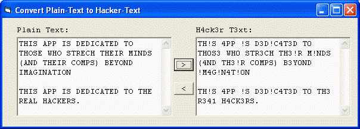



## h4ck3r\_t3xt \(Hacker Text\)

### Description

H0W T0 WR!T3 C0NFUS!NG BUT R34D4B13 T3XT...

Hi everyone! This little app will convert any plain-text into something like you can see above. It's confusing to look at, but it can still be read and understood... that's the way some hackers like to write.

If you want a taste of what this app can do... here's the above paragraph in hacker-text (as i call it)

H! 3V3RY0N3! TH!S 1!TT13 4PP W!11 C0NV3RT 4NY P14!N-T3XT !NT0 S0M3TH!NG 1!K3 Y0U C4N S33 4B0V3. !T'S C0NFUS!NG T0 100K 4T, BUT !T C4N ST!11 B3 R34D 4ND UND3RST00D... TH4T'S TH3 W4Y S0M3 H4CK3RS 1!K3 T0 WR!T3.

Hope you enjoy it. If you don't please do not send in annoying comments... I know this app does NOT do anything constructive. ;-)
 
### More Info
 

             |
---                |---
**Submitted On**   |2002-12-13 07:04:50
**By**             |[Harshad Sharma \(aka Datamatrix\)](https://github.com/Planet-Source-Code/PSCIndex/blob/master/ByAuthor/harshad-sharma-aka-datamatrix.md)
**Level**          |Beginner
**User Rating**    |4.0 (24 globes from 6 users)
**Compatibility**  |VB 6\.0
**Category**       |[Encryption](https://github.com/Planet-Source-Code/PSCIndex/blob/master/ByCategory/encryption__1-48.md)
**World**          |[Visual Basic](https://github.com/Planet-Source-Code/PSCIndex/blob/master/ByWorld/visual-basic.md)
**Archive File**   |[h4ck3r\_t3x1544782152003\.zip](https://github.com/Planet-Source-Code/harshad-sharma-aka-datamatrix-h4ck3r-t3xt-hacker-text__1-43228/archive/master.zip)

